# Image-filter
A GUI to allow the user to browse for images (grayscale and RGB), choose a filter and show the output. Filter examples (low pass, median, high pass, la placian) , Apply the filter in both spatial and frequency domains.  . Implement histogram equalization without libraries.
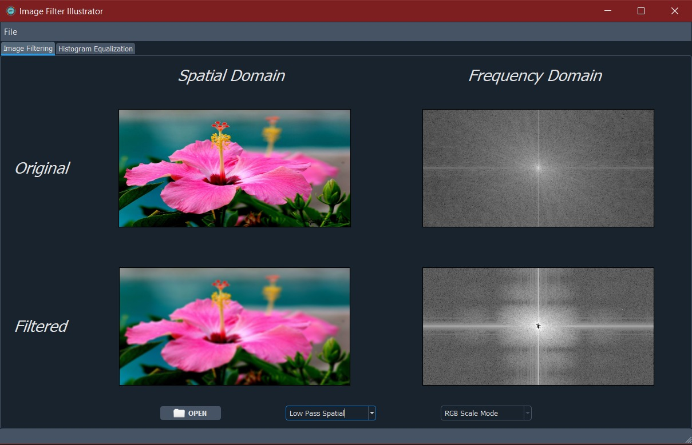
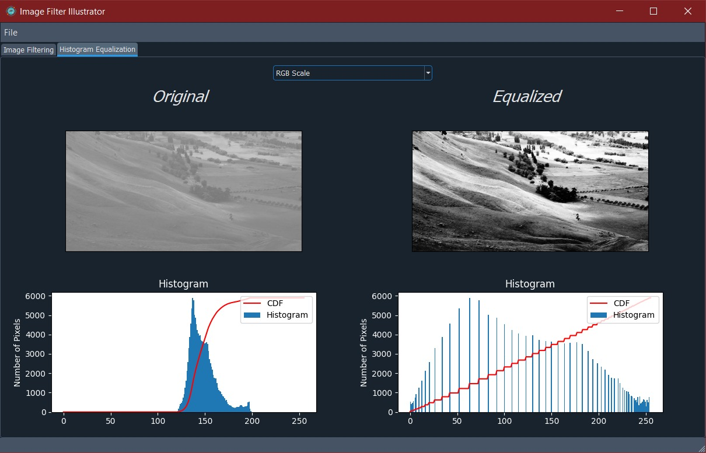
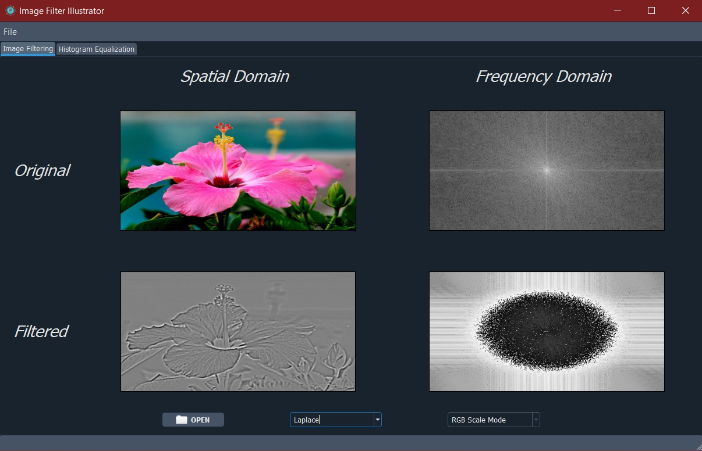
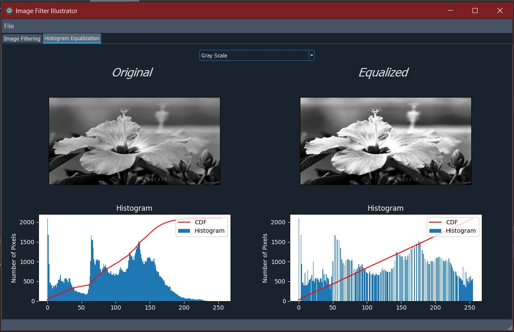
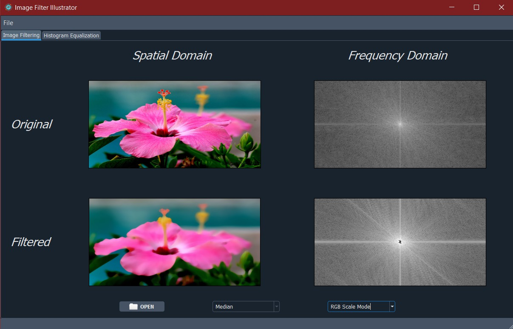
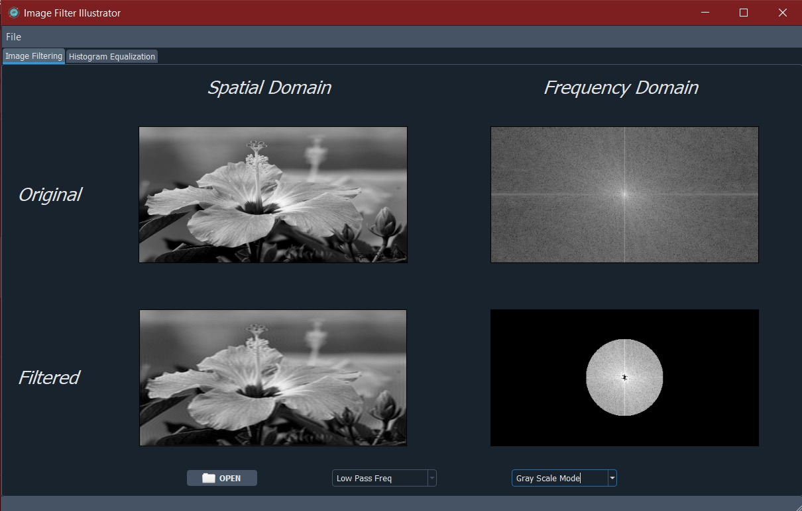
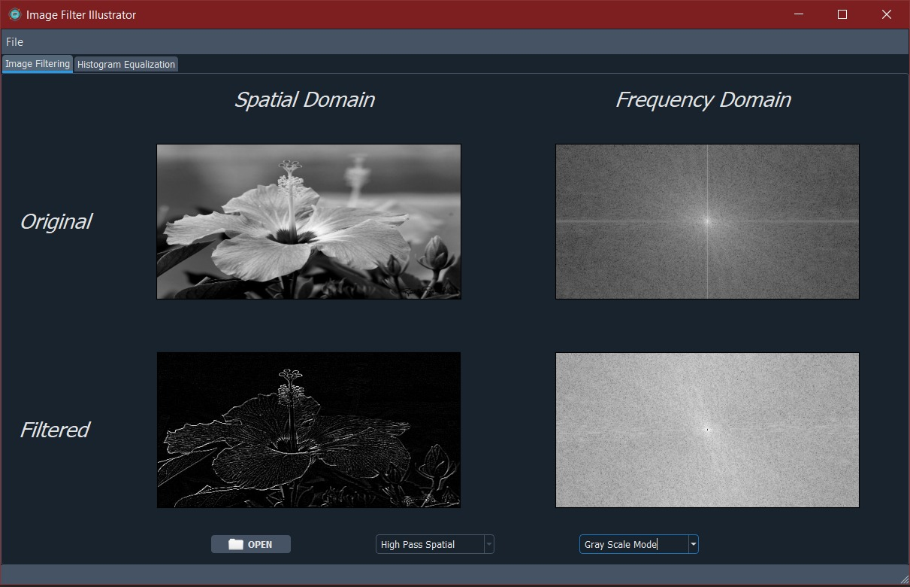
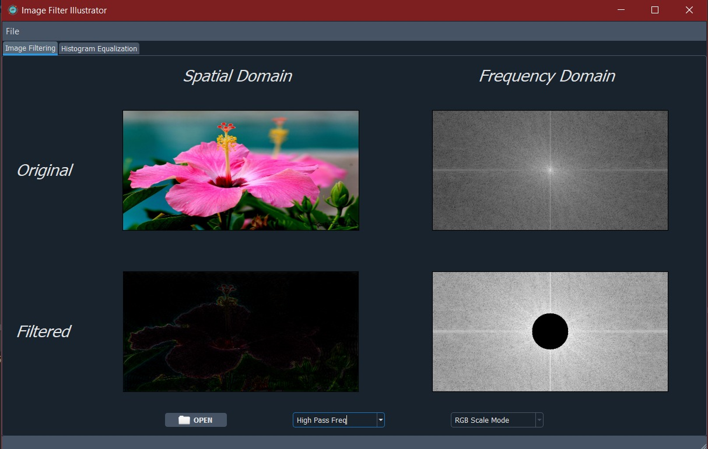
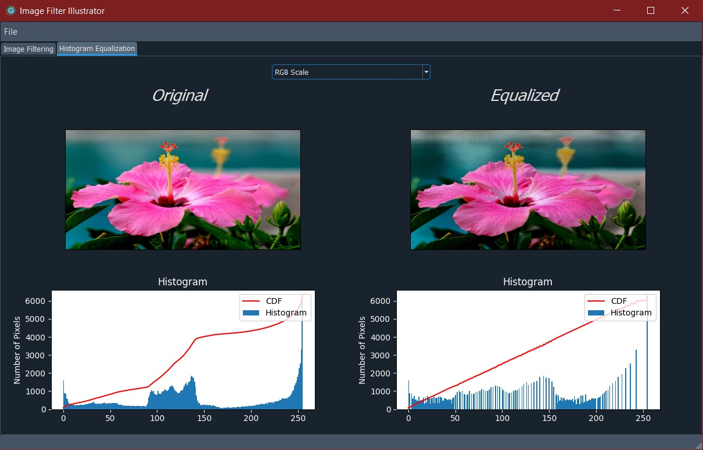
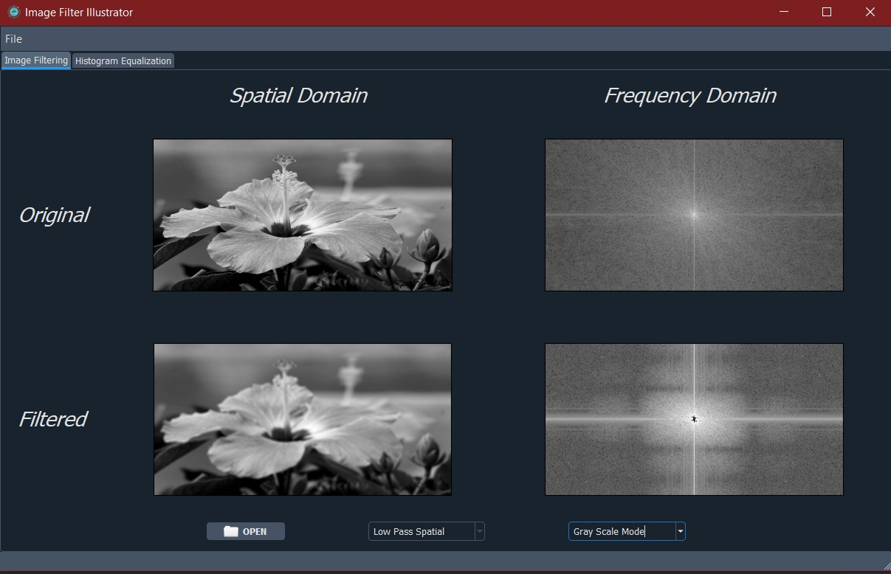
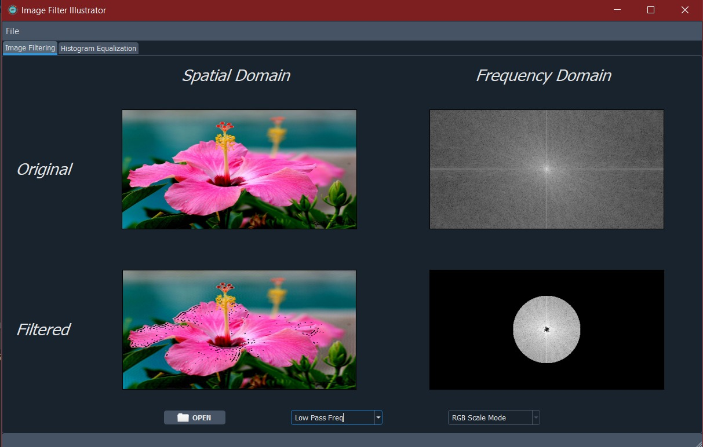
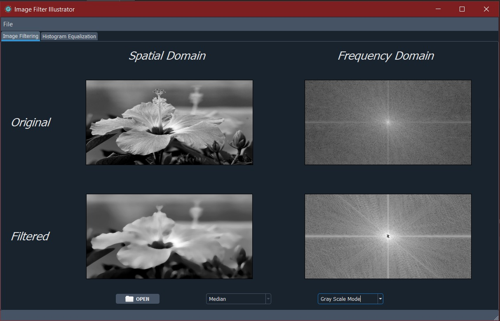
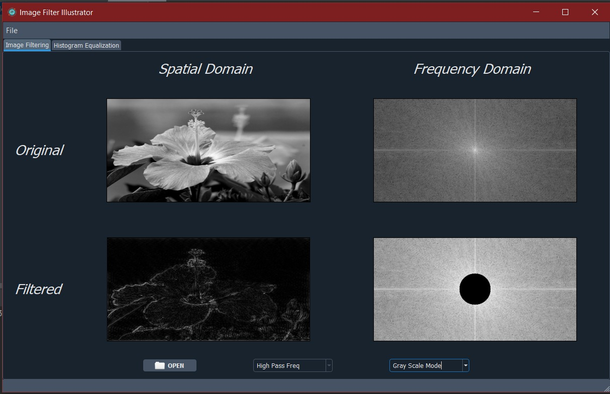
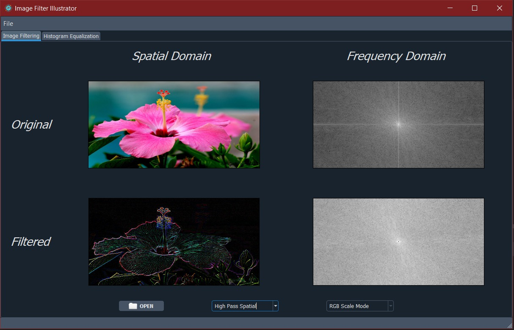

